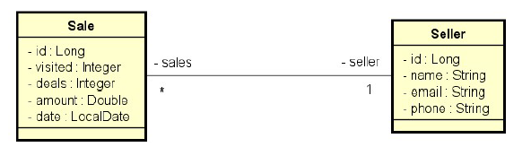

<h1 align="center"> Vendas </h1>

  <a href="#-tecnologias">Tecnologias</a>&nbsp;&nbsp;&nbsp;|&nbsp;&nbsp;&nbsp;
  <a href="#-projeto">Projeto</a>&nbsp;&nbsp;&nbsp;|&nbsp;&nbsp;&nbsp;

 

  

## 🚀 Tecnologias

Esse projeto foi desenvolvido com as seguintes tecnologias:

- Java
- Maven
- Spring Boot
- Spring Data JPA
- Hibernate
- Lombok
- H2 Database
- Git e Github

## 💻 Projeto

Trata-se de um projeto de vendas (Sale) e vendedores (Seller). Cada venda está para um vendedor, e um vendedor pode ter várias vendas.